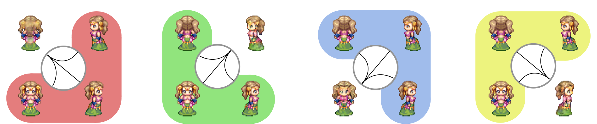

# MDIGAN Characters

This is the official source code repository for the paper "A Missing Data Imputation GAN for Character 
Sprite Generation" published in SBGames 2024. Read the paper here: [MDIGAN Characters][url-paper]. Play with
the [demo][url-demo] too. 



The proposed method is a GAN that generates characters in different poses given images of them in source ones. In 
particular, we trained the model in datasets of paired images of pixel art charcters in four poses: back, left, front, 
and right. The model can impute the image of a character in one of such poses, given either three, two or a single image
in other poses. Providing more images yields better results, but the model can still generate plausible images with only
a single for easier directions, such as generating the front pose given the back one.

---
## Requirements and Installation

The project was developed using Python 3.9 and Tensorflow 2.10.1. To install the required packages, run:

```bash
python -m venv venv
pip install -r requirements.txt
```

The datasets are included in the `datasets` folder in compressed format. They are automatically extracted when the 
training code is run for the first time.


---
## How to Train

The script `train.py` is used to train the model. It has several command-line arguments to configure the training 
procedure, such as the dataset to use, the number of epochs, the batch size, and the learning rate. A typical execution:

```bash
python train.py --rm2k --steps=40000 --no-tran --lambda-l1 100 --lambda-domain 10 --lambda-ssim 10 --lr 0.0001
```

The full list of arguments is:

| Parameter                  | Type        |                          Default | Description                                                                                                                                                                                      |
|----------------------------|-------------|---------------------------------:|--------------------------------------------------------------------------------------------------------------------------------------------------------------------------------------------------|
| `--lr`                     | `float`     |                           0.0001 | The initial learning rate                                                                                                                                                                        |
| `--batch`                  | `int`       |                                4 | Number of examples in each batch                                                                                                                                                                 |
| `--steps`                  | `int`       |                            10000 | Number of steps to update the generator when training                                                                                                                                            |
| `--evaluate-steps`         | `int`       |                             1000 | At which interval to pause training and show a preview with freshly generated images                                                                                                             |
| `--domains`                | `list[str]` | "back", "left", "front", "right" | Names of the domains related to the problem at hand. Should match the folders inside the dataset directory, with an additional number before it, starting with 0 (e.g., "0-back", "1-left" etc.) |
| `--image-size`             | `int`       |                               64 | Width and height of the input and output images                                                                                                                                                  |
| `--output-channels`        | `int`       |                                4 | Number of channels of the output images                                                                                                                                                          |
| `--input-channels`         | `int`       |                                4 | Number of channels of the input images                                                                                                                                                           |
| `--verbose`                | `bool`      |                            False | If additional information should be displayed                                                                                                                                                    |
| `--lambda-l1`              | `float`     |                              100 | Value for λreg used for the image generated in the forward step                                                                                                                                  |
| `--lambda-l1-backward`     | `float`     |                               10 | Value for λmcyc (cyclic) for the images reconstructed in the backward step                                                                                                                       |
| `--lambda-domain`          | `float`     |                               10 | Value for λdomain                                                                                                                                                                                |
| `--lambda-ssim`            | `float`     |                               10 | Value for λssim                                                                                                                                                                                  |
| `--no-aug`                 | `bool`      |                            False | Prevent the use of any data augmentation technique                                                                                                                                               |
| `--no-hue`                 | `bool`      |                            False | Prevent hue rotation as augmentation, but maybe allow translation                                                                                                                                |
| `--no-tran`                | `bool`      |                            False | Prevent translation as augmentation, but maybe allow hue rotation                                                                                                                                |
| `--capacity`               | `int`       |                                4 | The multiplier to the number of filters in each layer of the generator                                                                                                                           |
| `--input-dropout`          | `str`       |                     conservative | Applies dropout to the input as in the CollaGAN paper. Can be one from {none, original, curriculum, conservative (default)}                                                                      |
| `--cycled-source-replacer` | `str`       |                          forward | One from {dropout, forward (default)} indicating which images should be replaced by the forward generated one when computing the cycled images                                                   |
| `--rmxp`                   | `bool`      |                                  | Uses RPG Maker XP dataset                                                                                                                                                                        |
| `--rm2k`                   | `bool`      |                                  | Uses RPG Maker 2000 dataset                                                                                                                                                                      |
| `--rmvx`                   | `bool`      |                                  | Uses RPG Maker VX Ace dataset                                                                                                                                                                    |
| `--tiny`                   | `bool`      |                                  | Uses Tiny Hero dataset                                                                                                                                                                           |
| `--misc`                   | `bool`      |                                  | Uses the miscellaneous sprites dataset                                                                                                                                                           |

The training script creates a timestamped folder inside the `output` directory. It stores from configuration files to
previews of the generated images.

During training, at every 1000 steps (or the provided `--evaluate-steps`), the script will produce a preview of the
generated images. The preview is saved in the `output` folder, under a timestamped directory.

In addition, the script saves the model weights in the `saved-model` folder, as well as the configuration used in the 
training. It also saves the images generated at the end from the whole test set in the `test-images` folder.


---
## How to Generate Characters

The generator can be called after training by providing a list of input images in the [-1, 1] range, plus the target 
domain label. A typical execution is:

```python
# batch_of_images is a tensor with shape (batch_size, domains, image_size, image_size, channels)
# target_domain is a tensor with shape (batch_size,)
# the image that is to be imputed should be a zero tensor in the same shape as an input image 
#   (e.g., tf.zeros_like(batch_of_images[0, 0]))
generated = model.generator([batch_of_images, target_domain])
# generated is a tensor with shape (batch_size, image_size, image_size, channels) 
#
# The generated images are in the [-1, 1] range. To visualize them, use:
#   generated = (generated + 1) / 2
```

---
## How to Use a Custom Dataset

There are XXXX steps to use a custom dataset. As an overview:
1. Provide the dataset in the expected folder structure
2. Comment relevant lines in the `configuration.py` script, replacing them with the new dataset option
3. Add a new option to the `configuration.py` script to activate the new dataset
4. Run `train.py` providing the correct command-line arguments (`--domains`, `--image-size` etc.)

(1) The datasets are stored in the `datasets` folder. Each dataset is stored in a separate folder, and the images are
organized in subfolders named after the domain they belong to. The images are expected to be in PNG format and have the
same square dimensions. The dataset should be organized as follows:

```
datasets >
    DATASET_NAME >
        0-NAME_OF_FIRST_DOMAIN >
            0.png
            1.png
            ...
        1-NAME_OF_SECOND_DOMAIN >
            0.png
            1.png
            ...
        ...
```

PS: note that the names of the domains should match the ones used in the `--domains` argument when training the model.
In addition, the names of the domain folders should be numbered starting from 0 (e.g., "0-back" instead of just "back").

(2) Next, comment the lines in the `configuration.py` script that set the sizes of the datasets and replace them with 
others that describe your dataset:

```python
    # COMMENT the following lines
    dataset_mask = list(
            map(lambda opt: 1 if getattr(self.values, opt) else 0, ["tiny", "rm2k", "rmxp", "rmvx", "misc"]))
    dataset_sizes = [912, 216, 294, 408, 12372]
    dataset_sizes = [n * m for n, m in zip(dataset_sizes, dataset_mask)]
    train_sizes = [ceil(n * TRAIN_PERCENTAGE) for n in dataset_sizes]
    train_size = sum(train_sizes)
    test_sizes = [dataset_sizes[i] - train_sizes[i]
                  for i, n in enumerate(dataset_sizes)]
    test_size = sum(test_sizes)
    
    # REPLACE them with these:
    dataset_mask = [1]
    dataset_sizes = [YOUR_DATASET_SIZE]
    train_sizes = [ceil(YOUR_DATASET_SIZE * TRAIN_PERCENTAGE)]
    train_size = sum(train_sizes)
    test_sizes = [YOUR_DATASET_SIZE - train_sizes[0]]
    test_size = sum(test_sizes)
```

(3) As a third step, add a new argument to the `configuration.py` script in the "DATABASES" section, after this:
```python
    self.parser.add_argument("--misc", action="store_true", default=False,
                                 help="Uses the miscellaneous sprites dataset")
    # ADD here the new dataset option below... e.g,
    self.parser.add_argument("--my-dataset", action="store_true", default=False,
                                 help="Uses 'my custom dataset'")
```

(4) Now, when running the training script, provide the new dataset option as a command-line argument. In addition, 
you might also want to change the image size, number of channels, the names of the domains, and other options. 
For instance:

```bash
python train.py --my-dataset --domains "smiling" "sad" "angry" --image-size 128 --output-channels 3 --input-channels 3
```


[url-paper]: https://arxiv.org/abs/2409.10721
[url-demo]: https://fegemo.github.io/mdigan-characters
